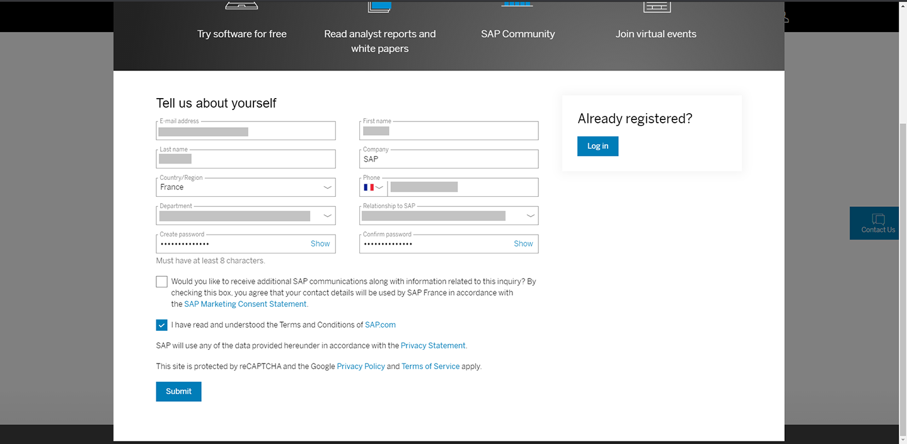
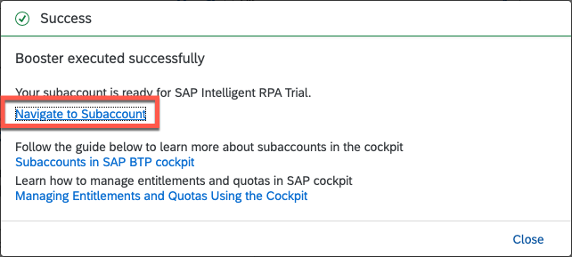
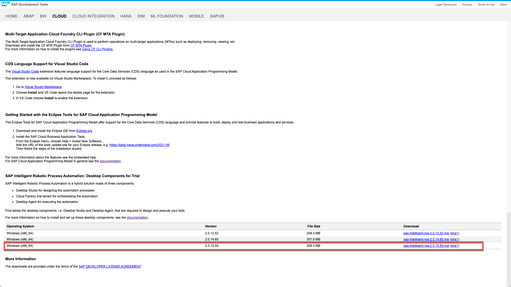
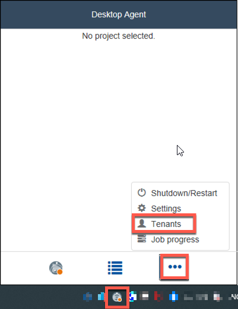

# Onboard to SAP Business Technology Platform Trial

[< Back to Overview](../README.md)

## Table of contents

<!-- TOC -->

- [Create Trial account in BTP](#create-trial-account-in-btp)
- [Setup SAP Intelligent Robotic Process Automation with Booster](#setup-sap-intelligent-robotic-process-automation-with-booster)
- [SAP Intelligent Robotic Process Automation Factory access](#sap-intelligent-robotic-process-automation-factory-access)
- [SAP Intelligent RPA On-premise Installation](#sap-intelligent-rpa-on-premise-installation)
- [Desktop Agent Tenant Registration](#desktop-agent-tenant-registration)

<!-- /TOC -->

## Create Trial account in BTP

Click on the button **Try for free** on the Free Trials page of SAP Business Technology Platform:

<https://www.sap.com/products/business-technology-platform/free-trials.html>

In the page, select the **Individual users** tab and click on the **Sign-up for a free trial** to enter requested information.

Fill the form and click on **Submit** and wait the Welcome message.

Click to start your trial experience!

Verify your account if needed

You need to **accept** the legal disclaimers for SAP BTP Trial to **Enter your Trial Account**.

Choose the data center **US East (VA) - AWS** and click **Creat Account** to trigger the trial account creation.

Once done click **Continue**

## Setup SAP Intelligent Robotic Process Automation with Booster

Click **Go To Your Trial Account**

Click **Boosters**

Search for **rpa** and click **Start** on Set up account for Intelligent RPA

Wait until the different have been done.

Click **Navigate to Subaccount**.

## SAP Intelligent Robotic Process Automation Factory access

Click on **Instances and Subscriptions**

Click on **SAP Intelligent Robotic Process Automation Trial**

A new Tab will open with the access to the **Intelligent Robotic Process Automation Factory** You can add the URL of the factory to your **favorites bookmarks** to have an easy access later.

> **Very important note**: This URL will be asked to be used as tenant when you setup your on-premise Desktop Agent

Click **OK** to proceed

 **Congratulations!**

## SAP Intelligent RPA On-premise Installation

Check the technical prerequisites and System requirements [here](https://help.sap.com/viewer/6b9c8e86a0be43539b670de962834562/Cloud/en-US/0061438816a34fa78b77c99852318c70.html)

Get the latest version of the SAP Intelligent RPA MSI from [SAP Development tools](https://tools.hana.ondemand.com/#cloud)

> **Note**: You will find it all the way in the bottom of the page.

Installing the components

- Double click on the MSI and click **Next \>**
- Choose the components to install and click **Next \>** for the following steps
- Click **Install**
- Wait the installation to complete
- Click **Finish**

In Windows search bar:

- Search for **Desktop Agent**
- Click on **Desktop Agent program**

## Desktop Agent Tenant Registration

Open your agent in the task bar, select **...** and **Tenants**

Click on **Add**

Enter a tenant **Name** and the **Domain** of your Intelligent RPA Factory (e.g. xxxxtrial.app.irpa-trial.cfapps.us10.hana.ondemand.comx)

Click on **Activate**

Click **OK**

## Conclusion

Congratulations! You have now successfully subscribed to the Business
Technology Platform Trial. You can use it to discover all
functionalities provided by SAP Workflow Management and SAP Intelligent
Robotic Process Automation!

[< Back to Overview](../README.md)