# Hello World Bot

[< Back to Overview](../README.md)

## Table of contents

<!-- TOC -->

- [Create the Hello World Bot](#create-the-hello-world-bot)
- [Test the Hello World Bot](#test-the-hello-world-bot)

<!-- /TOC -->

## Create the Hello World Bot

Click on **Projects**

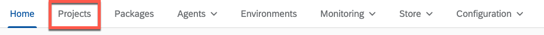

Select **New Project**

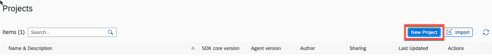

Enter the **Project name** (e.g., Hello World) and click **Create**

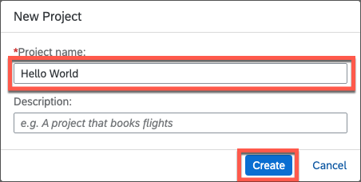

The Cloud Studio is automatically opened with the newly created project.

Click on the **+** button, select **Create** and **Automation**

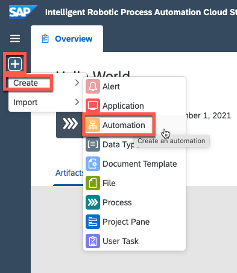

First you need to select the agent version installed

-   Click on the **Agent version** list

-   Select the latest local version released

-   Click on **Confirm**

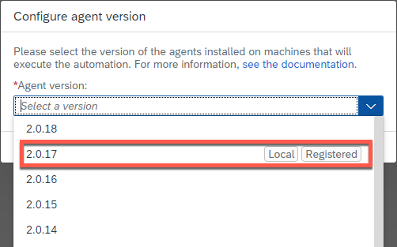

Give your Automation a **Name** (e.g., HelloWorld) and click **Create**

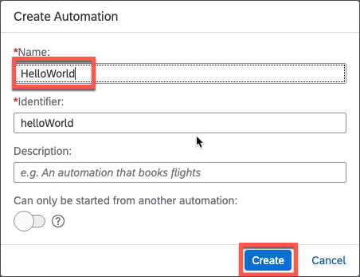

The new automation is created. We can now add activities to it.

Search for **Open** and drag the **Open Excel Instance** activity to the
flow.

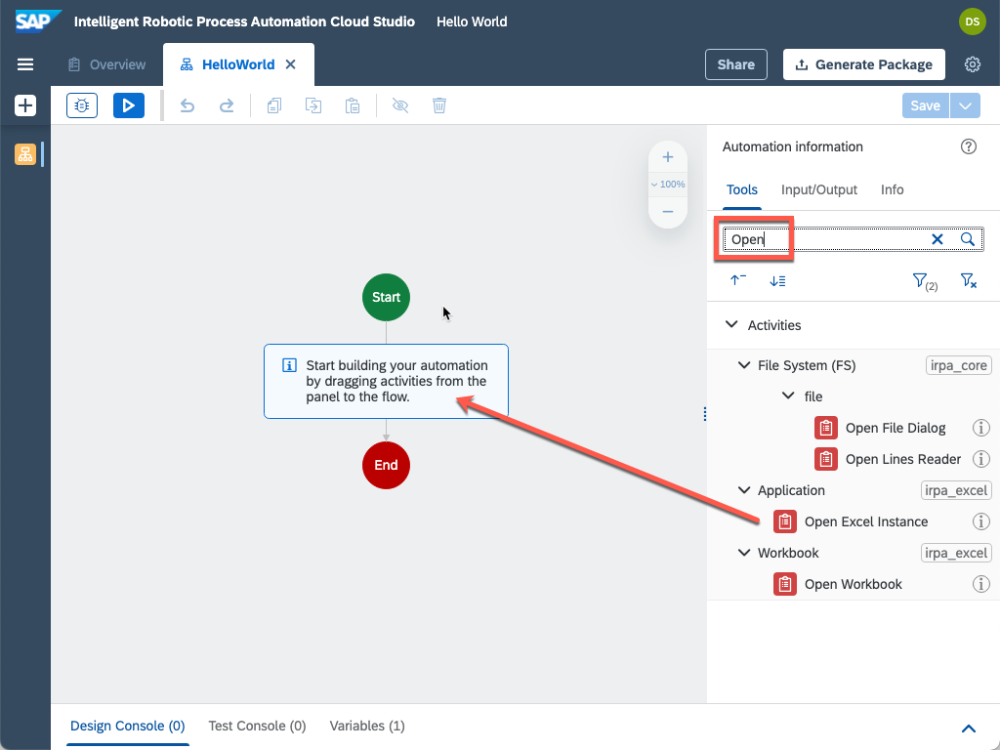

Search for **Add** and drag the **Add Worksheet** activity to the flow

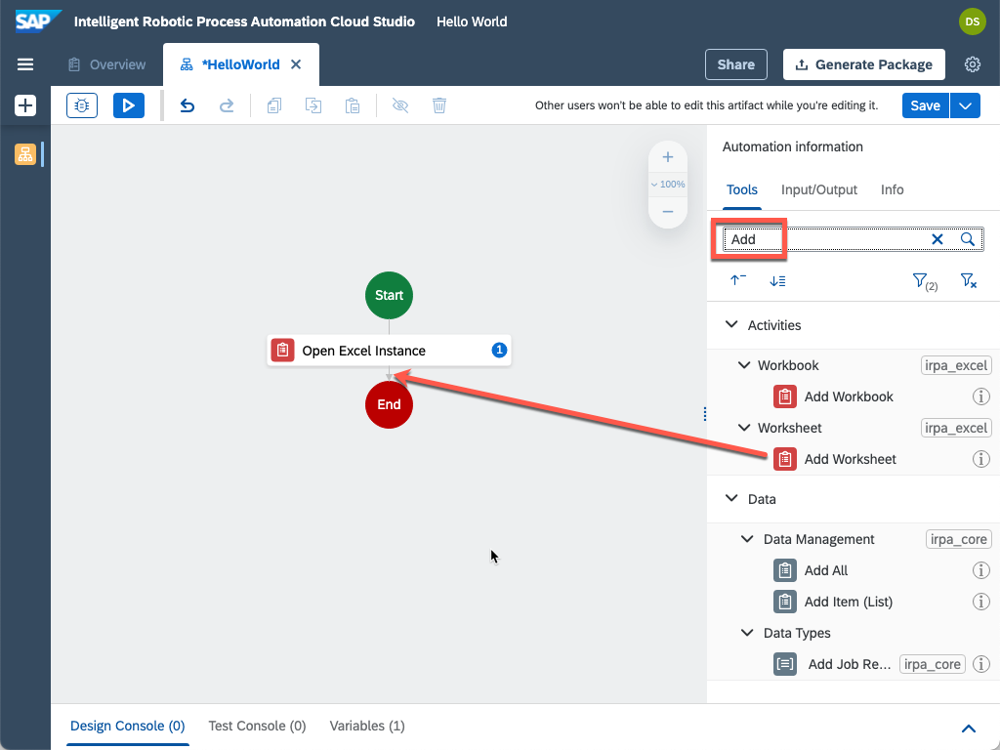

Click on the **Add Worksheet** activity in the flow to show its
parameters

Define a worksheetName (e.g., HelloWorld) and select the first option
provided which will define it as hardcoded string

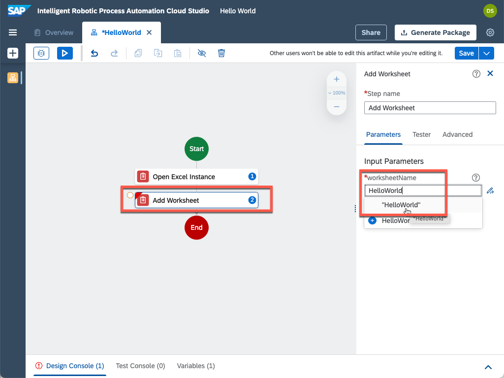

Search for **Set Values** and drag the **Set Values (Cells)** activity
to the flow

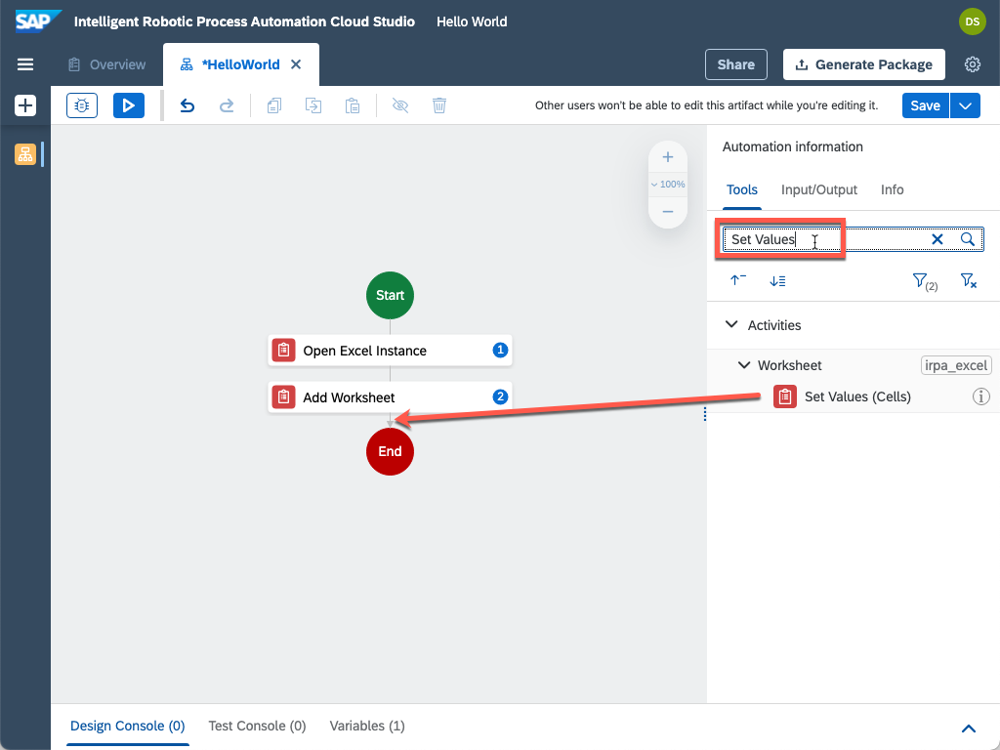

Select the Set Values (Cells) activity and set **rangeDefinition** to
**A1** and **values** to **Hello World**

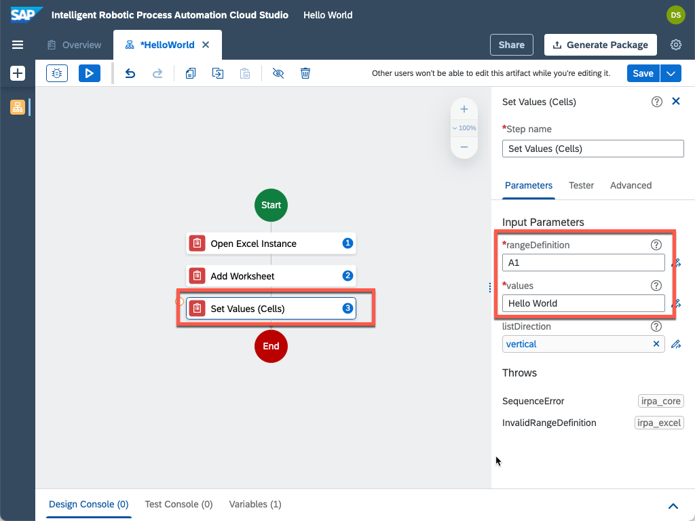

Search for **release** and drag the **Release Excel Instance** activity
to the flow

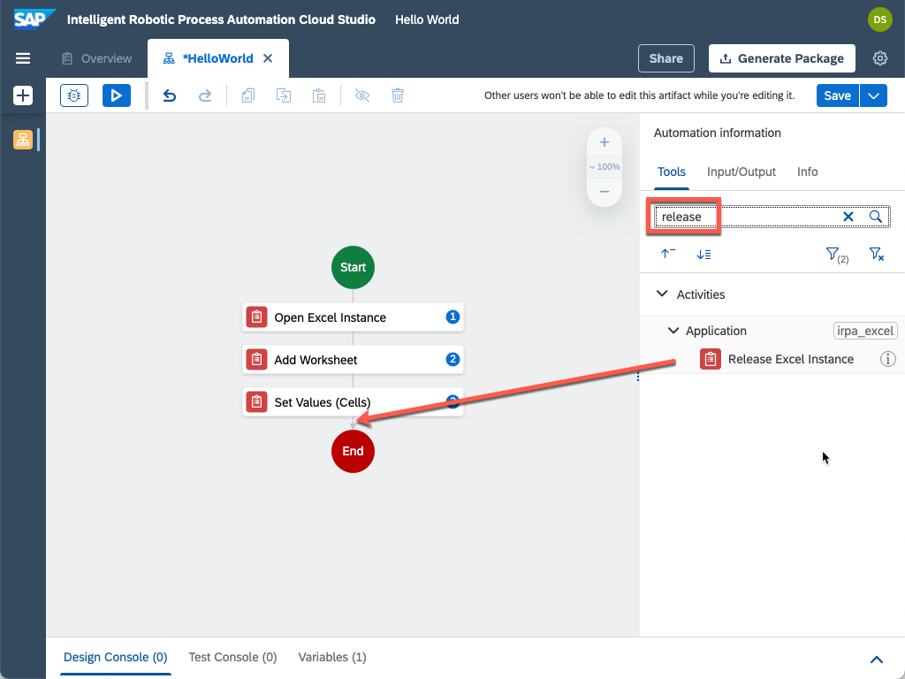

Congratulations! You have now successfully built your first Intelligent
RPA Project.

# Test the Hello World bot

To deploy the project to your Desktop Agent you need to create an
Environment.

Open the Environments tab in the Cloud Factory and click on **New
Environment**

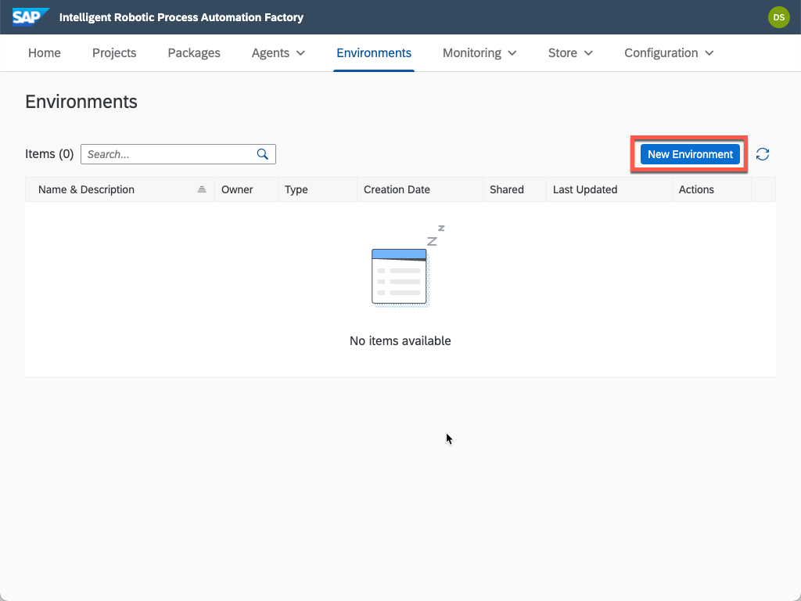

Give your environment a **Name** (e.g., Test Environment) and click
**Create**

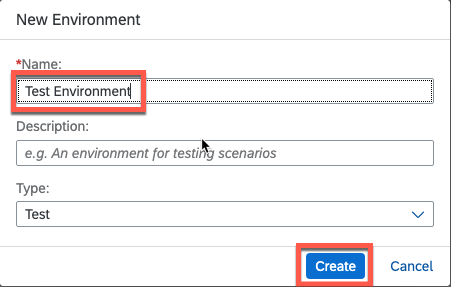

Now you need to assign your Agent to the newly created environment.

Press the **+ Add Agent** button to do so.

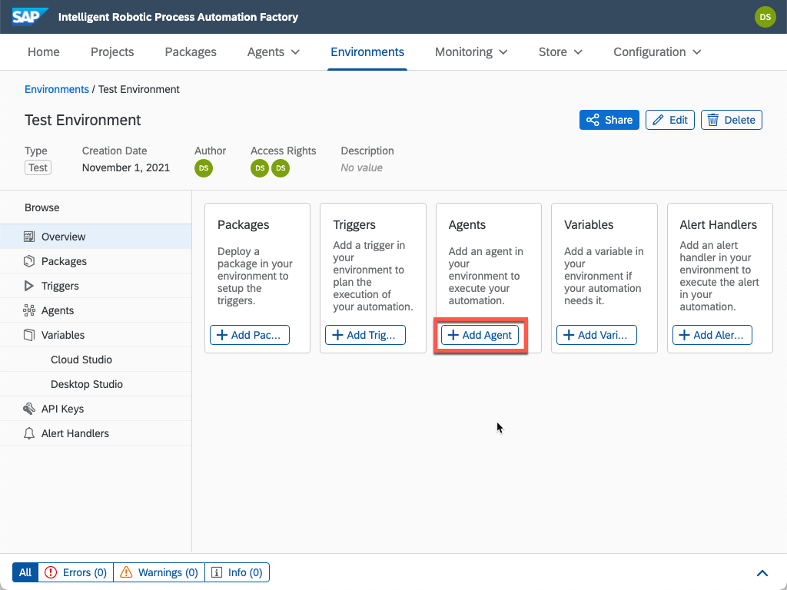

**Select** your agent and press **Add agent**.

If your agent doesn't show up, make sure it is connected to the Cloud
Factory tenant.

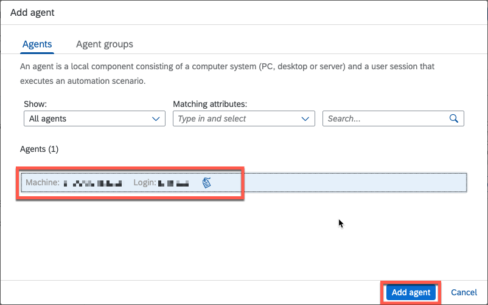
Now you are ready to test your project. Go back to the Cloud Studio and
press the **Test** button.

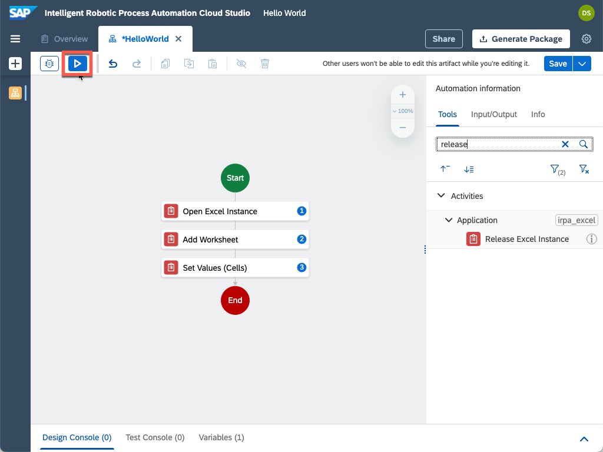

Select the **Environment** you just created and click **Test**

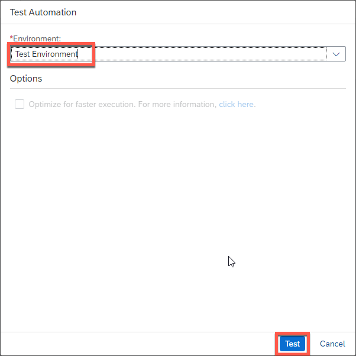

After few seconds of loading, the scenario is launched. An Excel file
appears with Hello World string set in the cell A1

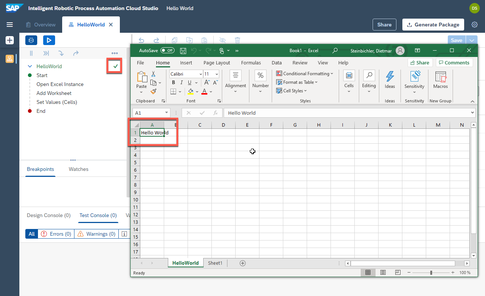

Congratulations! You have now successfully tested your first Intelligent
RPA Project.

[< Back to Overview](../README.md)